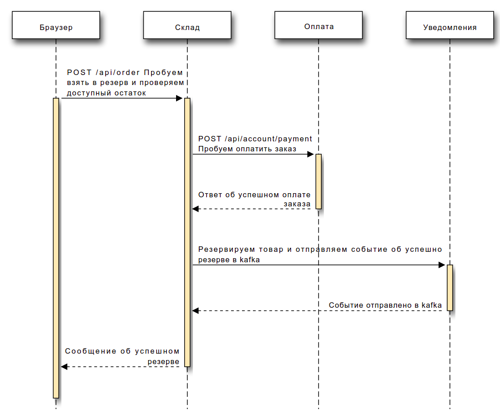
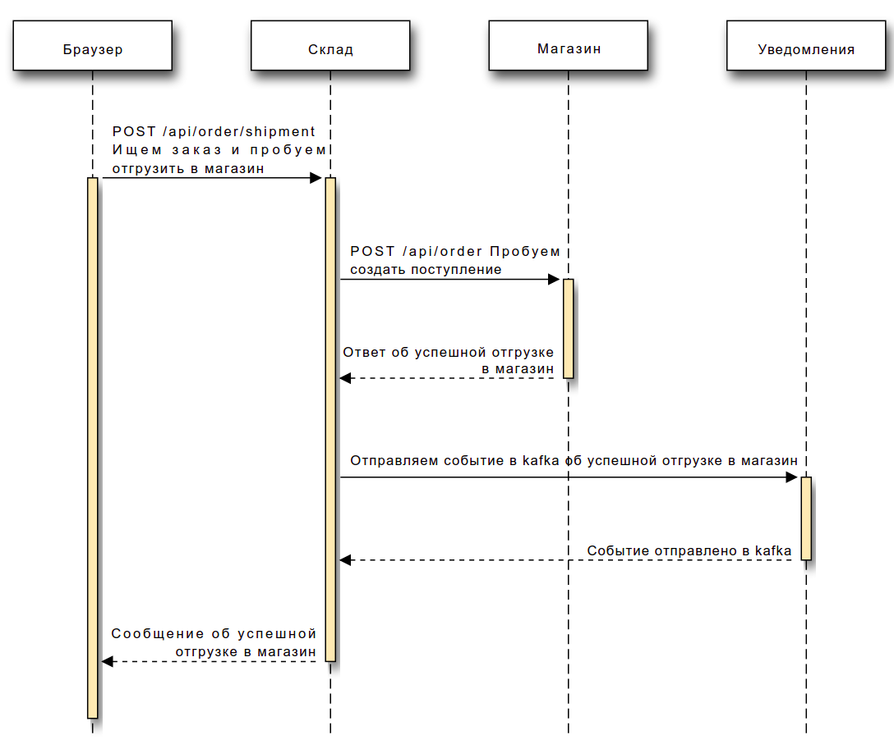
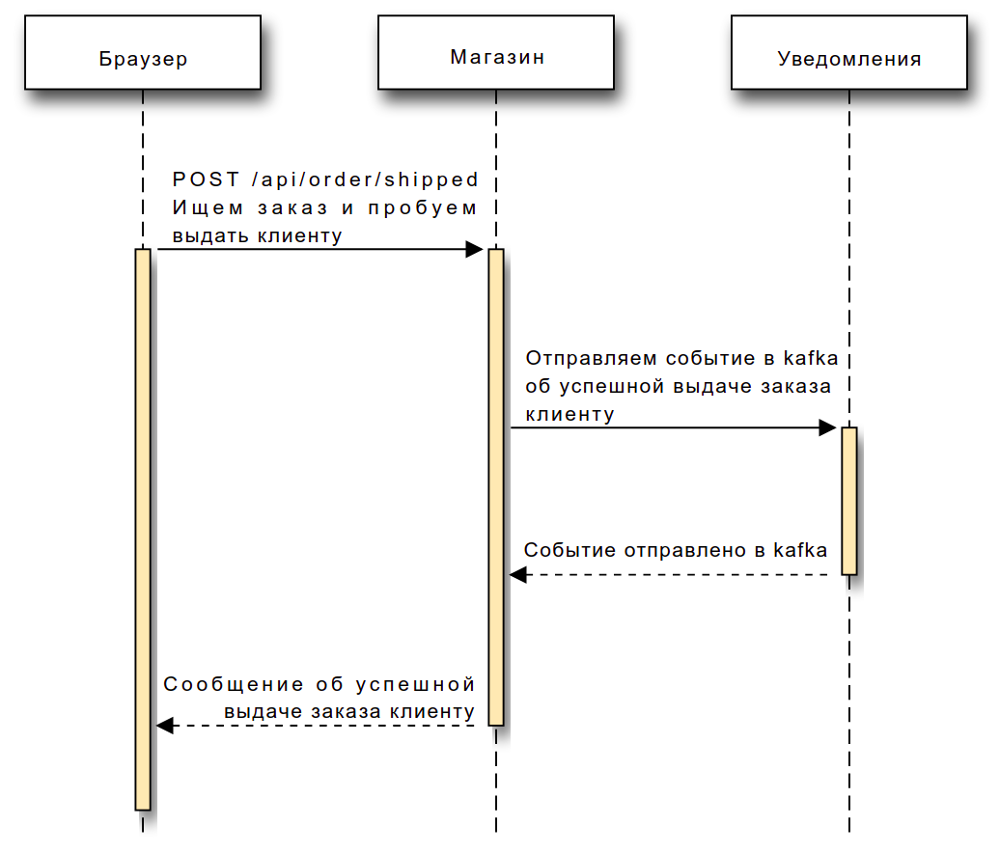
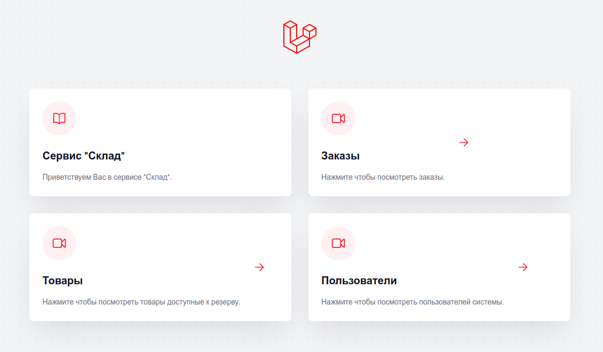
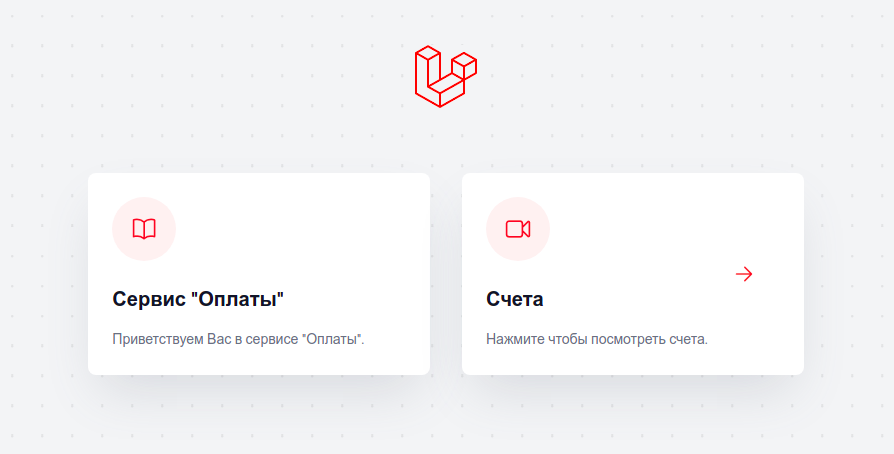
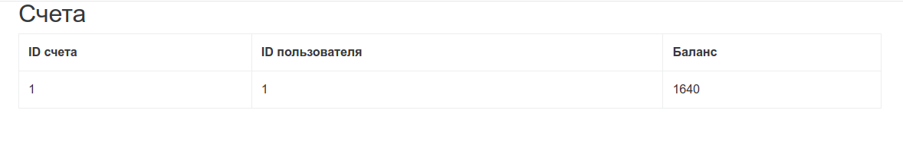
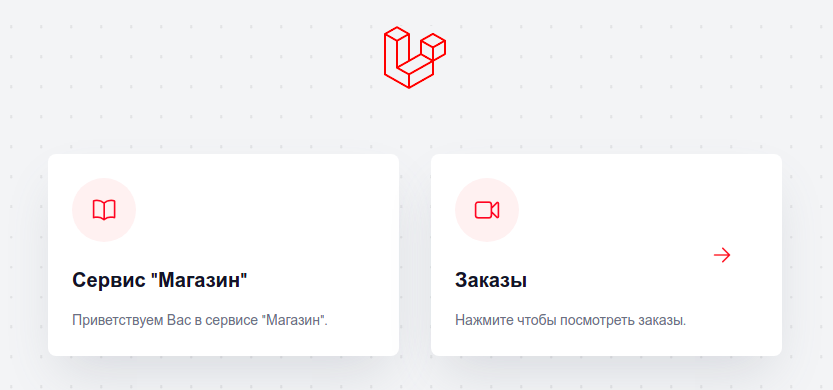
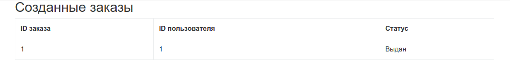
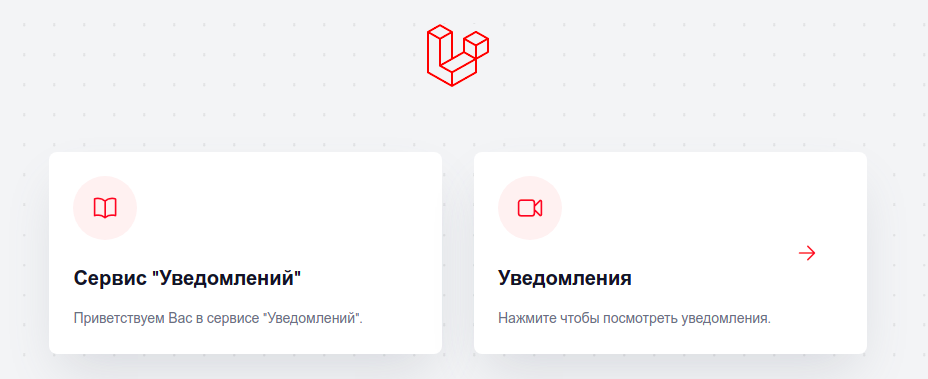
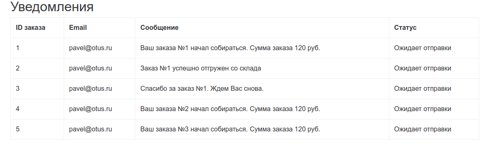

# Проектная работа

### Тема: Микросервисная архитектура управления складом и магазинами

О приложении: До внедрения ADR 0001-from-monolith-to-microservices был монолит как по коду так и по базе данных.
Существующее приложение вызывало много проблем у бизнеса, а именно были проблемы с масштабируемостью, адаптируемостью,
выводом новых фич на рынок. В указанном ADR написано контекст, решение и последствия с которыми пришлось столкнуться при
переходе от монолитного приложения к распределенной системе.

Перед разворачивании приложений необходимо ознакомиться с принятым ADR - /docs/ADR/0001-from-monolith-to-microservices.md

# Как развернуть приложения:

### -- Kafka
helm install -f Kafka/values.yaml kafka oci://registry-1.docker.io/bitnamicharts/kafka

### -- WarehouseApp (Сервис склада)

kubectl apply -f WarehouseService/pv.yaml -f WarehouseService/pvc.yaml &&
helm install postgresql-warehouse -f WarehouseService/pgsql-values.yaml bitnami/postgresql &&
kubectl create namespace warehouse && helm install warehouse-app WarehouseService/warehouse-chart/

### -- ShopApp (Сервис магазина)

kubectl apply -f ShopService/pv.yaml -f ShopService/pvc.yaml &&
helm install postgresql-shop -f ShopService/pgsql-values.yaml bitnami/postgresql &&
kubectl create namespace shop && helm install shop-app ShopService/shop-chart/

### -- BillingApp (Сервис оплаты)

kubectl apply -f BillingService/pv.yaml -f BillingService/pvc.yaml &&
helm install postgresql-billing -f BillingService/pgsql-values.yaml bitnami/postgresql &&
kubectl create namespace billing && helm install billing-app BillingService/billing-chart/

### -- NotificationApp (Сервис уведомлений)

kubectl apply -f NotificationService/pv.yaml -f NotificationService/pvc.yaml &&
helm install postgresql-notification -f NotificationService/pgsql-values.yaml bitnami/postgresql &&
kubectl create namespace notification && helm install notification-app NotificationService/notification-chart/

## Установка prometheus и grafana:
> helm install kube-prometheus oci://registry-1.docker.io/bitnamicharts/kube-prometheus -f prometheus

> kubectl port-forward --namespace default svc/kube-prometheus-prometheus 9090:9090

> helm install grafana oci://registry-1.docker.io/bitnamicharts/grafana -f grafana.yaml

> kubectl port-forward svc/grafana 8080:3000 (admin/admin)

#### Далее запускаем minikube tunnel
Minikube должен сформировать url - 192.168.49.2, если он будет другой, тогда необходимо его подставить в OrderService/order-chart/templates/configmap.yaml в
BILLING_APP_URL и NOTIFICATION_APP_URL и пересоздать приложение OrderApp.

В корне директории есть файл microservices.json - это коллекций для postman с подготовленным сценарием.

На рис 1. изображен примененный архитектурный стиль.

На рис 2. изображена диаграмма последовательности успешного резерва.

На рис 3. изображена диаграмма последовательности успешной отгрузки заказа в магазин.

На рис 4. изображена диаграмма последовательности успешной выдачи заказа клиенту в магазине.

На рис 5. изображен UI сервиса "Склад".

На рис 6. изображен UI сервиса "Склад".

На рис 7. изображен UI сервиса "Оплата".

На рис 8. изображен UI сервиса "Оплата".

На рис 9. изображен UI сервиса "Магазин".

На рис 10. изображен UI сервиса "Магазин".

На рис 11. изображен UI сервиса "Уведомления".

На рис 12. изображен UI сервиса "Уведомления".

