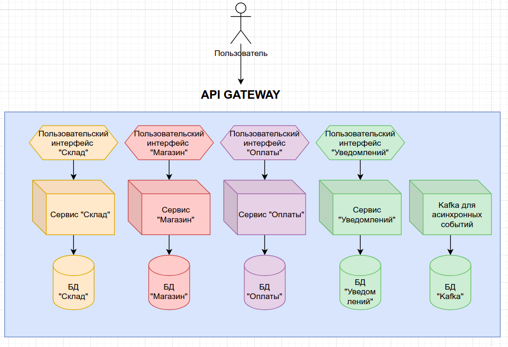

Для реализации задачи в которой необходимо создавать/оплачивать и присылать уведомление о заказе было сделано 3
микросервиса: Сервис заказов, сервис оплаты и сервис уведомлений. Ниже представлен успешный кейс когда клиенту получилось
оформить заказ. Все взаимодействие между сервисами происходит по HTTP протоколу с использованием REST API, так как проще
соблюсти CP систему.

### API, которые реализованы в микросервисе заказов:
1. [POST] /api/register - Регистрация пользователя.
2. [GET] /api/products - Просмотр всех товаров
3. [POST] /api/product - Создание товара
4. [GET] /api/product/{id} - Просмотр товара
5. [PUT] /api/product/{id} - Редактирование товара
6. [DELETE] /api/product/{id} - Удаление товара
7. [GET] /api/order - Просмотр всех заказов
8. [POST] /api/order - Создание заказа

### API, которые реализованы в микросервисе оплаты:
1. [POST] /api/register - Регистрация пользователя.
2. [GET] /api/accounts - Просмотр всех счетов
3. [POST] /api/account/replenishment - Пополнение счета
4. [POST] /api/account/payment - Оплата

### API, которые реализованы в микросервисе уведомлений:
1. [POST] /api/register - Регистрация пользователя.
2. [GET] /api/notifications - Просмотр всех уведомлений
3. [POST] /api/notification - Создание уведомления

# Как развернуть приложения:

### -- Kafka
helm install -f Kafka/values.yaml kafka oci://registry-1.docker.io/bitnamicharts/kafka

### -- WarehouseApp (Сервис склада)

kubectl apply -f WarehouseService/pv.yaml -f WarehouseService/pvc.yaml &&
helm install postgresql-warehouse -f WarehouseService/pgsql-values.yaml bitnami/postgresql &&
kubectl create namespace warehouse && helm install warehouse-app WarehouseService/warehouse-chart/

### -- ShopApp (Сервис магазина)

kubectl apply -f ShopService/pv.yaml -f ShopService/pvc.yaml &&
helm install postgresql-shop -f ShopService/pgsql-values.yaml bitnami/postgresql &&
kubectl create namespace shop && helm install shop-app ShopService/shop-chart/

### -- BillingApp (Сервис оплаты)

kubectl apply -f BillingService/pv.yaml -f BillingService/pvc.yaml &&
helm install postgresql-billing -f BillingService/pgsql-values.yaml bitnami/postgresql &&
kubectl create namespace billing && helm install billing-app BillingService/billing-chart/

### -- NotificationApp (Сервис уведомлений)

kubectl apply -f NotificationService/pv.yaml -f NotificationService/pvc.yaml &&
helm install postgresql-notification -f NotificationService/pgsql-values.yaml bitnami/postgresql &&
kubectl create namespace notification && helm install notification-app NotificationService/notification-chart/

#### Далее запускаем minikube tunnel
Minikube должен сформировать url - 192.168.49.2, если он будет другой, тогда необходимо его подставить в OrderService/order-chart/templates/configmap.yaml в
BILLING_APP_URL и NOTIFICATION_APP_URL и пересоздать приложение OrderApp.

В корне директории есть файл microservices.json - это коллекций для postman с подготовленным сценарием.
