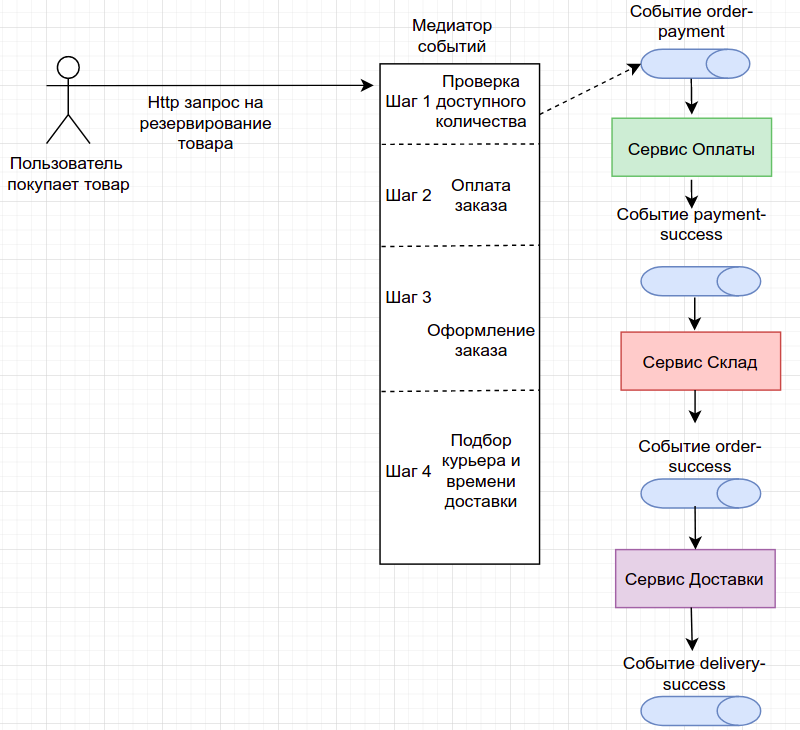

Для решения проблем в распределенной системы была выбрана сага хореография. Ее основные преимущества в том, что
каждый сервис не знает о существовании других и только создает и реагирует на завершенные события. Из недостатков, это
сложность тестирования и поиск проблем. Для этого необходимо настроить дополнительно трассировку и логирование событий с ключом идемпотентности.

На рис 1. изображен примененный архитектурный стиль на основе событий в распределенной системе.

# Как развернуть приложения:

### -- Kafka
helm install -f Kafka/values.yaml kafka oci://registry-1.docker.io/bitnamicharts/kafka

### -- WarehouseApp (Сервис склада)

kubectl apply -f WarehouseService/pv.yaml -f WarehouseService/pvc.yaml &&
helm install postgresql-warehouse -f WarehouseService/pgsql-values.yaml bitnami/postgresql &&
kubectl create namespace warehouse && helm install warehouse-app WarehouseService/warehouse-chart/

### -- BillingApp (Сервис оплаты)

kubectl apply -f BillingService/pv.yaml -f BillingService/pvc.yaml &&
helm install postgresql-billing -f BillingService/pgsql-values.yaml bitnami/postgresql &&
kubectl create namespace billing && helm install billing-app BillingService/billing-chart/

### -- DeliveryApp (Сервис доставки)

kubectl apply -f DeliveryService/pv.yaml -f DeliveryService/pvc.yaml &&
helm install postgresql-delivery -f DeliveryService/pgsql-values.yaml bitnami/postgresql &&
kubectl create namespace delivery && helm install delivery-app DeliveryService/delivery-chart/

#### Далее запускаем minikube tunnel
Minikube должен сформировать url - 192.168.49.2, если он будет другой, тогда необходимо его подставить в OrderService/order-chart/templates/configmap.yaml в
BILLING_APP_URL и NOTIFICATION_APP_URL и пересоздать приложение OrderApp.

В корне директории есть файл Otus8.json - это коллекций для postman с подготовленным сценарием.
