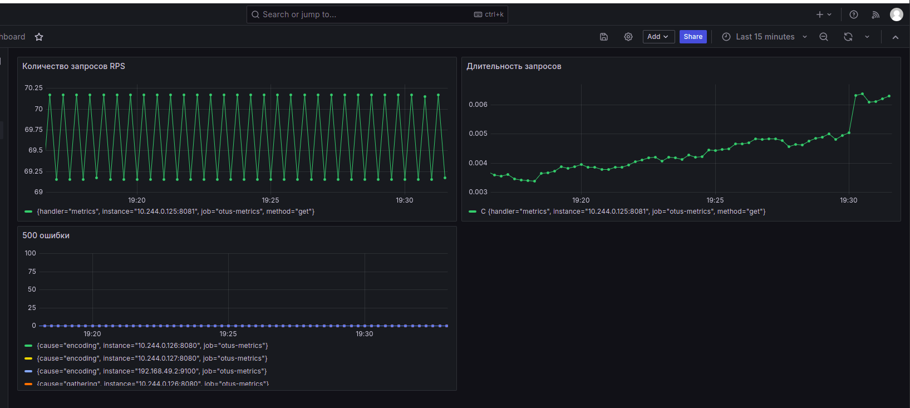

# Четвертое домашнее задание

### Установка postgresql через helm
1. Добавим репозиторий: 
> helm repo add bitnami https://charts.bitnami.com/bitnami

> helm repo update

2. Создадим pv и pvc:
> kubectl apply -f pv.yaml -f pvc.yaml

3. Установим postgresql с собственным values.yaml:
> helm install postgresql-dev -f pgsql-values.yaml bitnami/postgresql --set volumePermissions.enabled=true

4. Если нужен доступ из вне кластера:
> export POSTGRES_PASSWORD=$(kubectl get secret --namespace default postgresql-dev -o jsonpath="{.data.password}" | base64 -d) && kubectl port-forward --namespace default svc/postgresql-dev 5432:5432 &
PGPASSWORD="$POSTGRES_PASSWORD" psql --host 127.0.0.1 -U otus -d otus -p 5432

### Установка приложения через helm
> helm install otus-app otus/

> kubectl port-forward --namespace=m service/nginx-ingress-nginx-controller 8000:80

## Установка prometheus и grafana:
helm install kube-prometheus oci://registry-1.docker.io/bitnamicharts/kube-prometheus -f prometheus

helm install grafana oci://registry-1.docker.io/bitnamicharts/grafana -f grafana.yaml
kubectl port-forward svc/grafana 8080:3000 (admin/admin)

## Метрики приложения
Метрики приложения доступны по адресу: http://arch.homework:8000/metrics

* <b>otus_latency Latency</b> - Время ответя приложения реализовано с помощью метрики типа - Summary.
* <b>otus_rps</b> - RPS приложения, реализовано с помощью метрики типа - Counter.
* <b>otus_errorResponse</b> - 500 ошибки приложения, реализовано с помощью метрики - Counter.

Все метрики реализованы в разрезе API с помощью label - url.

Метрики приложения выведены в Grafana (JSON дашборда - dashboard-otus.json):

Метрики Kubernetes по Latancy, RPS, 500 (JSON дашбордка - dashboard-kube-otus.json):

Метрики по потреблению CPU, Memory подов namespace="otus" (JSON дашбордка - dashboard-kubernetes.json):

