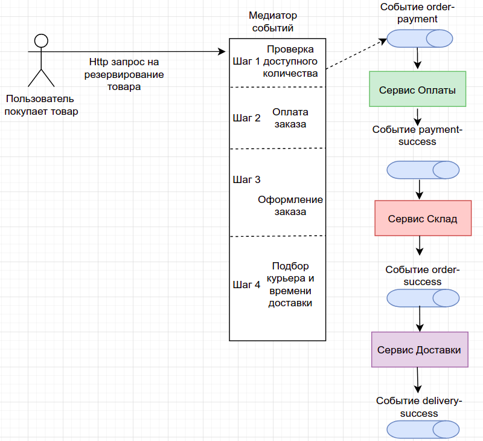

### Идемпотентость и коммутативность API в HTTP и очередях

Для решения идемпотетности был выбран вариант с естественным ключом идемпотентности. В качестве такого ключа
выступает ID заказа. Именно ID заказа уникально идентифицирует конкретный случай. Для этого перед резервом, если
есть доступное количество товара создается номер заказа в черновике, который начинает прокидываться во все события.
Каждый сервис обрабатывает ключ идемпотентности и сохраняет состояние в своей локальной БД. Если придет событие дубль, 
тогда консьюмер просто пропустит событие (возможен вариант чтобы слать новое событие об ошибке в kafka, чтобы уведомить о проблеме).

Проблемы с коммутативностью нет, так как процесс построен последовательно и не может быть ситуации, что одно событие пришло
раньше другого.

На рис 1. изображен примененный архитектурный стиль и на каждом этапе бизнеса-процесса резерва посылает ключ идемпотентности - ID заказа.

# Как развернуть приложения:

### -- Kafka
helm install -f Kafka/values.yaml kafka oci://registry-1.docker.io/bitnamicharts/kafka

### -- WarehouseApp (Сервис склада)

kubectl apply -f WarehouseService/pv.yaml -f WarehouseService/pvc.yaml &&
helm install postgresql-warehouse -f WarehouseService/pgsql-values.yaml bitnami/postgresql &&
kubectl create namespace warehouse && helm install warehouse-app WarehouseService/warehouse-chart/

### -- BillingApp (Сервис оплаты)

kubectl apply -f BillingService/pv.yaml -f BillingService/pvc.yaml &&
helm install postgresql-billing -f BillingService/pgsql-values.yaml bitnami/postgresql &&
kubectl create namespace billing && helm install billing-app BillingService/billing-chart/

### -- DeliveryApp (Сервис доставки)

kubectl apply -f DeliveryService/pv.yaml -f DeliveryService/pvc.yaml &&
helm install postgresql-delivery -f DeliveryService/pgsql-values.yaml bitnami/postgresql &&
kubectl create namespace delivery && helm install delivery-app DeliveryService/delivery-chart/

#### Далее запускаем minikube tunnel
Minikube должен сформировать url - 192.168.49.2, если он будет другой, тогда необходимо его подставить в OrderService/order-chart/templates/configmap.yaml в
BILLING_APP_URL и NOTIFICATION_APP_URL и пересоздать приложение OrderApp.

В корне директории есть файл Otus9.json - это коллекций для postman с подготовленным сценарием.
