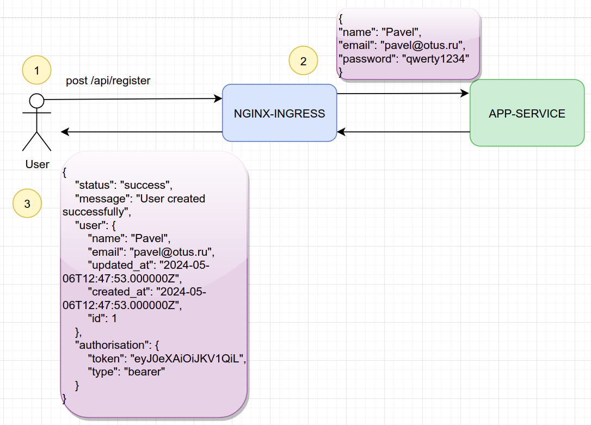

# Шестое домашнее задание

### Установка postgresql через helm
1. Добавим репозиторий: 
> helm repo add bitnami https://charts.bitnami.com/bitnami

> helm repo update

2. Создадим pv и pvc:
> kubectl apply -f pv.yaml -f pvc.yaml

3. Установим postgresql с собственным values.yaml:
> helm install postgresql-dev -f pgsql-values.yaml bitnami/postgresql --set volumePermissions.enabled=true

4. Если нужен доступ из вне кластера:
> export POSTGRES_PASSWORD=$(kubectl get secret --namespace default postgresql-dev -o jsonpath="{.data.password}" | base64 -d) && kubectl port-forward --namespace default svc/postgresql-dev 5432:5432 &
PGPASSWORD="$POSTGRES_PASSWORD" psql --host 127.0.0.1 -U otus -d otus -p 5432

### Установка приложения через helm
> helm install otus-app otus/

> kubectl port-forward --namespace=m service/nginx-ingress-nginx-controller 8000:80

### Схема регистрации:

Авторизация реализована с использованием Bearer токена!

После регистрации/логина/рефреша возвращается Bearer токен!
Данный токен необходимо слать во всех API запроса, иначе будет редирект на страницу логина.

### API, которые реализованы в данной домашнем задании:

1. [POST] /api/register - Регистрация пользователя. 
2. [POST] /api/login - Авторизация пользователя. 
3. [POST] /api/logout - Разлогин пользователя. 
4. [POST] /api/refresh - Обновление токена. 
5. [GET] /api/users - Получение всех пользователей. 
6. [GET] /api/user/{id} - Получение пользователя по заданному ID. 
7. [PUT] /api/user/{id} - Обновление пользователя по заданному ID. 

В файле six.postman_collection.json находятся коллекции запросов под основные сценарии. Необходимо учесть, что
после регистрации/логина система возвращает токен, с которым необходимо стучаться для получения доступа к API.

